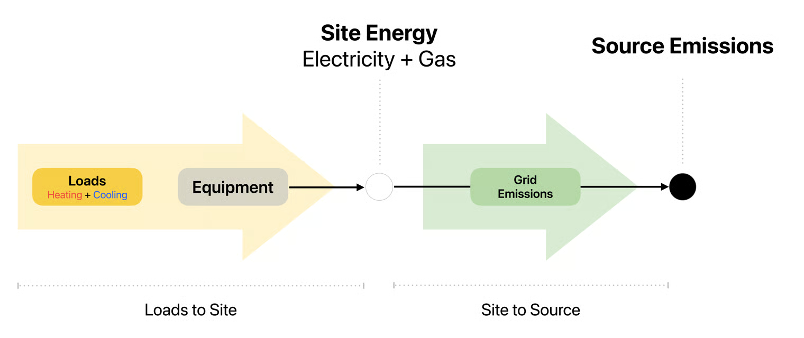

# Calculations

The tool uses two main calculation functions: [Loads to Site Energy](calculations.md#loads-to-site-energy) and [Site Energy to Source Emissions](calculations.md#site-energy-to-source-emissions). A high-level explanation for the calculations is provided here.

<figure><figcaption></figcaption></figure>

### Loads to Site Energy

The first step is to convert heating and cooling loads to electricity and gas site energy.

#### Inputs

* Hourly heating and cooling load profile with outdoor air temperature.
* Equipment library with performance curves and efficiencies.
* User-specified equipment scenario (HR WWHP, AWHP, backup heating and cooling). See [Equipment](equipment.md#inputs) for details.

#### **Calculation**

Loads are allocated in 6 phases, one for each type of equipment present in the scenario.

**Phase 1: Heat Recovery Water-to-Water Heat Pump (HR WWHP)**

* Any simultaneous heating and cooling load is served by the HR WWHP, limited by its maximum capacity and minimum turndown. There is assumed to be a single unit.
* Electricity usage is calculated using operating efficiency for each hour. See [Equipment](equipment.md#heat-recovery-water-to-water-heat-pump-hr-wwhp) for how the efficiency is determined.

**Phase 2: Heating Air-to-Water Heat Pump (AWHP)**

* The number of AWHPs is determined as described in [Equipment](equipment.md#air-to-water-heat-pump-awhp).
* The heating load served (i.e., capacity) and operating efficiency for each hour are calculated as described in [Equipment](equipment.md#air-to-water-heat-pump-awhp). These are used to calculate the electricity usage.

**Phase 3: Natural Gas Boiler**

* If the backup heating equipment is a natural gas boiler, all remaining heating load after the HR WWHP and AWHP is served with gas.
* Fuel usage is calculated using a fixed efficiency year-round.

**Phase 4: Electric Resistance Heater**

* If the backup heating equipment is an electric resistance heater, all remaining heating load after the HR WWHP and AWHP is served with electricity. Phases 3 and 4 are mutually exclusive; only one of the two is executed for any given scenario.
* Electricity usage is calculated using a fixed 100% efficiency year-round.

**Phase 5: Cooling Air-to-Water Heat Pump (AWHP)**

* The number of AWHPs is equal to that calculated for heating in Phase 2.
* Electricity usage is calculated in the same manner as Phase 2.

**Phase 6: Electric Chiller**

* All remaining cooling load after the HR WWHP and AWHP is served with an air-cooled chiller.
* Electricity usage is calculated using a fixed efficiency year-round.

<figure><figcaption>
Loads to Site Energy Calculation Steps
</figcaption></figure>

#### Outputs

* Hourly total and per-fuel energy usage.
* Hourly capacity, efficiency, served load, and energy usage for each equipment.

#### Key Simplifications

* Water temperature-dependent performance is fixed at rated temperatures for the selected equipment (no temperature resets), except leaving condenser water temperature for AWHPs in heating.
* AWHP capacity and efficiency is dependent only on outside air temperature (no part-load ratio, no cycling losses, no defrost derate).
* HR WWHP efficiency is dependent only on part load. Equipment does not operate below minimum turndown (no cycling modeled).
* No auxiliary fan or pump energy use is modeled.
* All equipment operates ideally up to capacity limits.
* Instantaneous dispatch: no control dynamics or lag.

### Site Energy to Source Emissions

The second step is to convert the electricity and gas site energy, and any refrigerant usage, to CO2-equivalent source emissions.

#### Inputs

* Hourly total and per-fuel energy usage.
* Electricity emissions dataset filtered by scenario and region.
* User-specified emissions settings (years, type, weighting). See [Emissions](emissions.md#inputs) for details.

#### Calculation

**Step 1: Compute electricity emissions rate**

* The total electricity emissions rate is calculated as the weighted sum of the short-run marginal emissions rate (SRMER) and the long-run marginal emissions rate (LRMER).&#x20;

**Step 2: Merge emissions and loads data**

* The electricity emissions data is taken from Cambium (see further information in [Emissions](emissions.md)) in month-hour average format (data is provided for each hour of a representative day for every month). This is expanded to match with the full 8,760-hour resolution of the site energy data.

**Step 3: Calculate emissions**

* The total emissions for each fuel is calculated using the total usage and fuel emissions rate.
* The total emissions associated with refrigerant leakage is calculated using the type, weight, and annual leakage rate for the the refrigerant in each equipment. Leakage is assumed to be spread evenly over the year.
  * Refer to [Emissions](emissions.md#refrigerant-leakage) for leakage rate assumptions.
  * Refer to the [equipment library](equipment.md#inputs) for refrigerant type and weight assumptions. The 100-year global warming potential (GWP) from the [IPCC AR6 dataset](https://catalog.data.gov/dataset/ipcc-ar4-ar5-and-ar6-20-100-and-500-year-gwps) is used.

#### Outputs

* Hourly total and per-source emissions.

#### Key Simplifications

* Condensed (month-hourly) electricity emissions data is used instead of a true hourly time series.

### Future Development

1. Allow sizing for AWHPs based on cooling load or the larger of heating and cooling load, instead of heating only.
2. Add functionality to size and vary the number of HR WWHPs.
3. Add functionality to derate performance data to account for reported vs field performance and/or defrost.
4. Add functionality for water cooled chillers.
5. Add cooling tower water use calculations.
6. Add functionality for chiller performance tables and/or curves instead of fixed COP.
7. Add fuel switching evaluation (based on grid emissions and equipment COP).
8. Add load shifting evaluation (thermal energy storage).
9. Add exhaust air heat recovery as an optional heat source for WWHPs.
10. Add functionality for AWHP models with heat recovery.
11. Add utility cost calculations.
